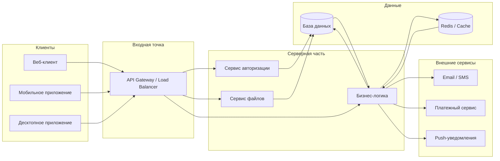

# Архитектура клиент-сервер

Ниже представлена общая схема архитектуры клиент-серверного приложения.

## Описание

- Клиенты: веб, мобильные и десктопные приложения обращаются к серверу через единый входной слой.
- API Gateway / Load Balancer: принимает запросы, выполняет маршрутизацию, балансировку нагрузки и базовую защиту.
- Сервис авторизации: управляет аутентификацией и токенами доступа.
- Бизнес-логика: реализует основную функциональность приложения.
- База данных и кэш: хранят состояние системы и ускоряют чтение данных.
- Внешние сервисы: используются для отправки уведомлений, платежей и интеграций.

Эта диаграмма подходит для базового представления клиент-серверной архитектуры и может быть расширена для микросервисов, очередей сообщений или контейнеров.